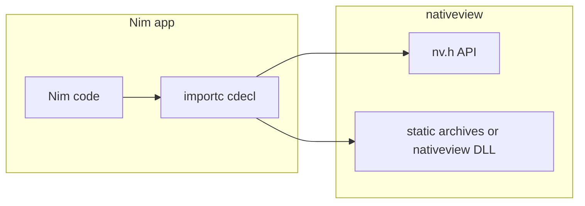

# Nim bindings for nativeview

## Context

- **Authoritative API**: `[include/nv.h](include/nv.h)` (app/window lifecycle, web load, JS eval, `nv_on_message` / `nv_on_ready` / `nv_send`, `nv_eval_js_batch`, etc.) plus `[include/nv_hotkey.h](include/nv_hotkey.h)`.
  - **In-scope additions over Pascal**: `nv_version_string` and `nv_get_version_info` (from `[include/nv_util.h](include/nv_util.h)`, included by `nv.h`) — trivial to bind now; better than retrofitting later.
  - **Explicitly deferred**: `[include/nv_menu.h](include/nv_menu.h)` — `nv_app_set_menu` takes a recursive self-referential `nv_menu_item_t`* which requires a forward-declared Nim type and is non-trivial; deferred to a follow-up binding PR.
- **Reference implementation**: `[bindings/pascal/nativeview.pas](bindings/pascal/nativeview.pas)` + `[docs/Pascal.md](docs/Pascal.md)` + `[examples/pascal/](examples/pascal/)`.
- **Linking** (same economics as Pascal, but Nim plan **defaults documentation and examples to static**):
  - **Static (primary)**: Build with `-DNV_BUILD_SHARED=OFF` (default). Nim uses no `-d:nativeviewShared`; all symbols are plain `{.importc, cdecl.}` and the linker resolves archives via `--passL:...`.
    - **GNU ld / MinGW** (matches root `[CMakeLists.txt](CMakeLists.txt)` ~140-149, ~204-213): wrap `nv-runtime`, `nv-platform-`*, `nv-ops`, `nv-ipc`, `nv-core` in `-Wl,--start-group` / `-Wl,--end-group` (or `--whole-archive` / `--no-whole-archive`); document which pattern the Nim scripts use.
    - **MSVC**: link `.lib` archives in dependency order, add WebView2 + Win32 system libs (same set as `nativeview_shared` block ~190-201 in CMakeLists). Do **not** define `NV_SHARED` for static.
    - **macOS**: archive order + frameworks as in `[examples/pascal/build_static_example.sh](examples/pascal/build_static_example.sh)`. **Prominently warn** in both `docs/Nim.md` and the example README: static linking on macOS tends to crash before the window appears (AppKit event-loop ownership); the **shared** path (`-d:nativeviewShared`) is the recommended choice for macOS GUI apps. Do not bury this in a footnote.
    - **Toolchain rule**: Nim's backend (MinGW vs MSVC) must match how the `.lib`/`.a` files were built.
  - **Shared (optional)**: CMake `-DNV_BUILD_SHARED=ON` -> `nativeview_shared` output named `nativeview` (`[CMakeLists.txt](CMakeLists.txt)` ~154-216). Nim sets `-d:nativeviewShared` -> `{.dynlib: "nativeview".}`. Any C TU that includes `nv.h` under MSVC also needs `NV_SHARED` (`[include/util/nv_log.h](include/util/nv_log.h)`).

## Deliverables

1. `**bindings/nim/nativeview.nim**` — Low-level module:
  - Opaque handles as `distinct pointer`: `NvApp`, `NvWindow`.
  - **Manual** `NvWindowCfg` object matching `nv_window_cfg_t` field order and types (`cint`, `cstring`) — avoids fragile `header:` paths; same rationale as Pascal `{$packrecords c}`.
  - Callback types `{.cdecl.}` matching `nv_msg_cb_t`, `nv_ready_cb_t`, `nv_close_cb_t`.
  - All procs from the Pascal unit (same symbol names), **plus** `nv_version_string` / `nv_get_version_info` (new over Pascal).
  - `nv_eval_js_batch`: declared as `ptr UncheckedArray[cstring]` + `csize_t`; example must show the full `cast` call pattern (see Risks section).
  - **Conditional linking**: default = static (no dynlib). `-d:nativeviewShared` attaches `{.dynlib: "nativeview".}` and documents DLL search-path on Windows.
  - Hotkey constants (`NV_HOTKEY_*`) as `const` ints.
2. `**bindings/nim/nativeview.nimble`** — Package metadata: `srcDir = "."`, `requires "nim >= 1.6"`, brief description; no new third-party deps. Optional `task staticCheck` for type-only checking (link flags supplied by user).
3. `**bindings/nim/config.static.nims.example**` — Checked-in template with commented `switch("passL", ...)` lines using `NV_CMAKE_BUILD_DIR`-style placeholders so embedders copy to `config.nims` and fill one variable.
4. `**docs/Nim.md**` — Parallel to `docs/Pascal.md`:
  - **macOS warning at the very top**: "On macOS, static linking tends to crash before the window appears (AppKit event-loop ownership). Use `-d:nativeviewShared` for macOS GUI apps." Mirror the exact phrasing from `[examples/pascal/build_static_example.sh](examples/pascal/build_static_example.sh)`.
  - **Static linking** as the first major section: configure CMake -> build archives -> `nim c --passL:...` with per-platform archive order and system libs.
  - **Shared DLL** as a shorter section.
  - **GC safety rule** stated explicitly: pass a `pointer` to a module-level variable as `userdata`; never pass a pointer to a Nim GC-managed heap object without anchoring. Event/JSON string pointers from `nv_on_message` are valid only for the duration of the callback — copy with `$` if needed.
  - `NV_SHARED` note scoped to: shared builds + any C TU that includes `nv.h` under MSVC.
5. `**examples/nim/`** — Minimal sample + **first-class static build scripts**:
  - App: `nv_on_ready` callback calls `nv_load_html`; demonstrates `nv_eval_js_batch` `cast` pattern; cleans up with `nv_app_destroy`.
  - `build_static.sh` / `build_static.ps1`: configure CMake `-DNV_BUILD_SHARED=OFF`, build the five static targets, then `nim c` with the correct `--passL` chain for the host OS.
  - README opens with the macOS static caveat and directs macOS users to use shared instead.
  - Optional README subsection for shared (`-d:nativeviewShared` + `PATH` / `DYLD_LIBRARY_PATH`).
6. **Docs index** — Update `[docs/Implementation.md](docs/Implementation.md)` Stage 1 bullet to also mention Nim: `bindings/nim/`, `docs/Nim.md`, `examples/nim/`, static build scripts.

## Non-goals (initial PR)

- Auto-generated wrappers for the full `include/*.h` surface (`nv_json`, `nv_ipc`, legacy `nv_window.h`).
- `nv_menu.h` / `nv_app_set_menu` (deferred — recursive struct).
- Mandatory CI job installing Nim (soft optional follow-up).
- Changing CMake to build Nim by default.

## Verification

- **Required**: run `examples/nim/build_static.`* on at least one dev platform (Windows or Linux) to prove static `nim c` + full archive link works.
- **Secondary**: optional shared one-liner with `-d:nativeviewShared` + `nativeview.dll` / `.so` on `PATH`.
- Optionally: `nim check` on `nativeview.nim` in CI when Nim is available.

## Risks / notes

- **Callback GC safety** (concrete rule): pass a `pointer` to a **module-level** variable as `userdata`; never pass a Nim GC-managed heap pointer without anchoring (`GC_ref` / ORC root). Event/JSON strings from `nv_on_message` are only valid inside the callback — copy with `$`. The example callback must follow this pattern; `docs/Nim.md` must state the rule explicitly.
- **macOS static crash**: prominently warn — not a Nim bug, same AppKit behaviour as Pascal. Recommend shared for macOS GUI.
- `**nv_eval_js_batch` ABI**: show the `cast[ptr UncheckedArray[cstring]]` pattern in the example or it will be misused by Nim newcomers.
- `**nv_menu_item_t` deferred**: self-referential struct requires non-trivial Nim forward-decl; track as a follow-up, not a blocker.
- **Struct ABI**: keep `NvWindowCfg` field-for-field identical to C; if `nv.h` gains fields later, update Nim + Pascal together.

