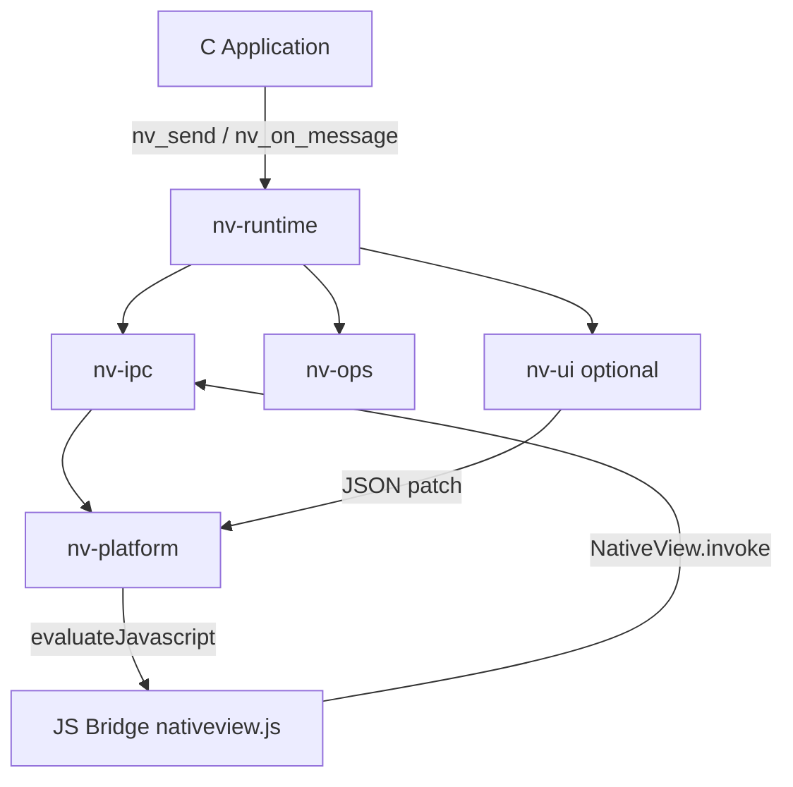

# Architecture — nativeview

nativeview is a modular C11 library for embedding native WebViews with a bidirectional JavaScript bridge. Platform code stays in `modules/nv-platform-*/`; shared logic lives in `modules/nv-*`.

---

## Module dependency graph

Modules form a strict DAG (no cycles):

```
nv-core → nv-ipc → nv-ops → nv-runtime → nv-platform-{mac,win,linux,android,ios}
                    └→ nv-ui → nv-designer (optional)
nv-http (depends on nv-core only)
nv-sdk (meta-package linking the selected stack)
```

| Module | Role |
|--------|------|
| `nv-core` | Arena allocator, strings, JSON, logging, utilities |
| `nv-ipc` | JSON-RPC framing, dispatch, JS script injection |
| `nv-ops` | Native capability handlers (`fs`, `dialog`, `window`, …) |
| `nv-runtime` | App/window lifecycle, window manager |
| `nv-platform-*` | WKWebView, WebView2, WebKitGTK, Android JNI, iOS |
| `nv-ui` | Optional reactive widget layer (Vue-owned DOM) |
| `nv-http` | Optional embedded HTTP server (local/dev use) |

See also [project_structure.md](project_structure.md) and [AGENTS.md](../AGENTS.md).

---

## High-level data flow



1. **C application** creates `nv_app_t`, windows, and optional message handlers.
2. **nv-runtime** owns lifecycle and routes messages.
3. **nv-ipc** serializes JSON-RPC-style requests/responses and notifications.
4. **Platform backend** evaluates JavaScript in the WebView and delivers inbound messages from JS.
5. **nv-ops** implements named methods (`window.setTitle`, `fs.readText`, …) registered at startup.

---

## C ↔ JavaScript IPC

### Wire format

Messages use a compact JSON object:

- `e` — event or method name (e.g. `fs.readText`, `app.handshake`)
- `d` — payload (object or null)
- `s` — optional request id for request/response pairing

The bundled script (`assets/nativeview.js` on mobile, injected on desktop) exposes:

- `NativeView.invoke(method, data)` — async request/response
- `NativeView.send(event, data)` — fire-and-forget to native
- `NativeView.on(event, fn)` — native → JS push events

Desktop reference: [js-bridge.md](js-bridge.md). Android: [Android.md](Android.md).

### Handshake

After the WebView loads, JS calls `app.handshake` with `wireVersion`. Native validates compatibility before routing ops. Mismatches surface as `ERR_VERSION_MISMATCH`.

### Security boundaries

- **File system ops** operate on paths the host app allows; sandboxing is the embedder’s responsibility.
- **Shell exec** runs platform shell commands — treat as privileged.
- **Origin checks** on Android gate `deliverWebMessage` for non-`file://` pages.

---

## nv-ui: reactive widget layer

When `NV_BUILD_UI=ON`, `nv-ui` provides a VCL-inspired component tree in C. **Vue owns the DOM** after the initial scaffold load; C never writes arbitrary HTML afterward.

### Component model

- Single node type `nv_component_t` with a type enum (`NV_COMP_BUTTON`, `NV_COMP_VUE`, …).
- **Owner** frees memory (arena); **parent** controls layout tree.
- State lives in `nv_component_state_t` union fields.

### Flush cycle

1. **First flush** — generate full Vue scaffold HTML/JS and load into the WebView.
2. **State change** — `NV_SET_STATE` or field updates call `nv_ui_schedule_diff`.
3. **Subsequent flushes** — diff against snapshot table (`nv_form_snap_t`); send minimal JSON patch via `nv_eval_js`.
4. **Vue** applies bindings; delegated listeners forward `click` / `input` / `change` to C as `nv.event`.

### Events

| Slot | Widgets | JS bridge |
|------|---------|-----------|
| `NV_EVENT_CLICK` | Button, Checkbox | `click` |
| `NV_EVENT_INPUT` | Input, Slider, Textarea | `input` |
| `NV_EVENT_CHANGE` | Input, Select, Textarea | `change` |

Widget reference: [widget-reference.md](widget-reference.md). Vue slots: [vue-slot-guide.md](vue-slot-guide.md).

---

## `NV_COMP_VUE` slot

C owns a rectangular region (`x`, `y`, `w`, `h`). JavaScript mounts a Vue `createApp` instance per slot:

- `nv_vue_load_component(slot, js_fn_body)` — body returns a component definition
- `nv_vue_set_props(slot, props_json)` — merge props into the slot’s reactive object

**Rule:** once mounted, DOM inside the slot is owned by JS/Vue; C must not mutate it.

---

## Platform backend isolation

- No `#ifdef` platform blocks outside `modules/nv-platform-*/`.
- Public API in `include/nv.h` uses opaque handles and is NULL-safe.
- Internal hooks declared in `nv_*_internal.h` are implemented per platform.

---

## Multi-window and IPC bus

- **Window manager** (`nv_window_manager`) tracks windows by string id.
- **`windows.*` ops** — open, close, focus, list (see [js-bridge.md](js-bridge.md)).
- **`ipc_bus.send`** — deliver events to a specific window or broadcast (`to: "*"`).

Push events include `windows.opened`, `windows.closed`, `fs.changed`, `tray.clicked`, `notification.clicked`.

---

## Optional: nv-http

`nv-http` is a single-threaded, blocking HTTP server for local static assets or dev tooling. It is **not** intended for high-concurrency production workloads.

---

## Designer output (planned)

`nv-designer` will emit pure C:

- `myform_ui.c` — designer-owned, between `NV_DESIGNER_BEGIN` / `NV_DESIGNER_END` markers
- `myform.c` — user-owned event handlers

No intermediate `.nvui` format.
